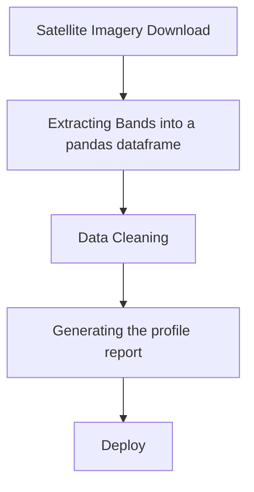

# Exploratory Data Analysis of Satellite Imagery
### Introduction

Exploratory data analysis (EDA) provides a way of visualizing, summarizing and interpreting your data so that you can derive
hidden information. This information helps to make decisions about statistical methods to employ that will be helpful in 
achieving accurate data analysis. Deriving information from remotely sensed images deeply depends on statistical methods. For instance 
image classification is purely a machine learning task that involves building models that will be used to predict the classes that every pixel within the image will fall, depending
on the digital values within every pixel. For this reason it is very important to perform EDA.

### Quantitative Tasks to Perform
- Distribution of data
- Missing Data
- Duplicate rows
- Correlation
- Variations
- Interactions among variables

### Pandas Profiling
Pandas profiling is a library that generates profile reports from a pandas dataframe, courtesy of [Simon Brugman](https://pandas-profiling.ydata.ai/docs/master/rtd/).
The libary present the report in an interactive hmtl report. The following are some of the statistics that can be genrated;
- Detect the types of columns in a dataframe.
- Missing values matrix
- Quantile statistics
- Descriptive statistics
- Histograms
- Correlations
- Duplicate rows
- Text analysis

### Methodology

### Was it Helpful to do EDA on satellite imagery?
#### Histogram
Important in visualizing information content within an image. It shows the quality of the original image in terms of its contrast.

#### Correlation

#### Interaction of Bands

#### Number of pixels across the 6 training classes
From the frequency graph below, it is clear that there is no balance among class samples in the training datasets

